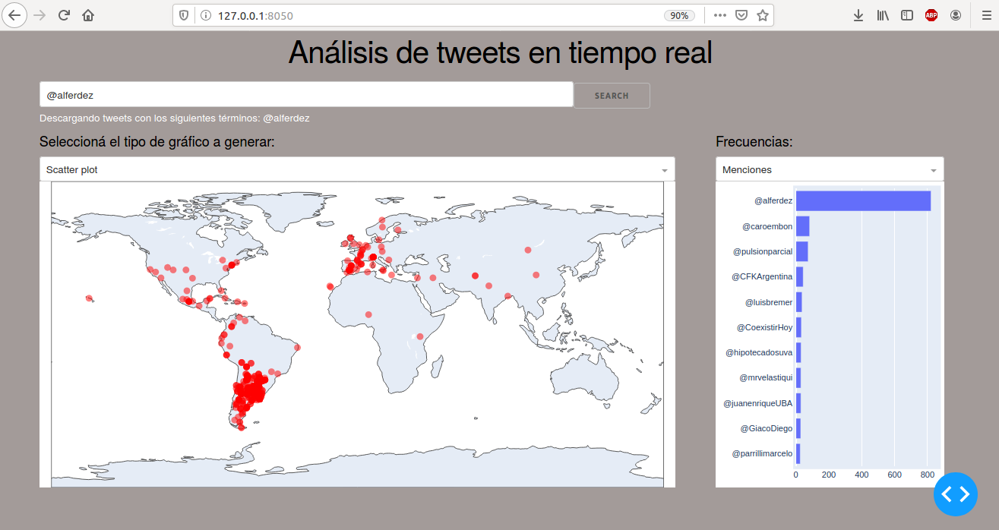

# Trabajo Final: Análisis espacial con Python
# Georeferenciación de tweets en tiempo real

### Descripción
El trabajo consiste en un tablero de visualización de datos obtenidos en tiempo real de la red social twitter. El usuario realiza una query (a partir de usuarios, hashtags, palabras clave o cualquier combinación de estas) que genera un dataframe de tweets con el stream de tweets que es descargado en consistencia con la query que realiza el usuario.
Permite la visualización de dos tipos de plots:
- Mapas: scatter plot en base a las coordenadas y choropleth
- Barplots con frecuencias:



### Instalación de dependencias en un ambiente virtual

```sh
$ virtualenv envAnalisisEspacial --python=python3
$ source /home/{yourHomeName}/envAnalisisEspacial/bin/activate
$ pip3 install requeriments.txt
```

### Ejecución

```sh
$ python3 plotDash.py
```

### Pendientes
- Mejorar performance
- Permitir la comparación de dos queries, mostrarlas con diferentes colores en el scatter map

### LICENCIA
GNU v.3
